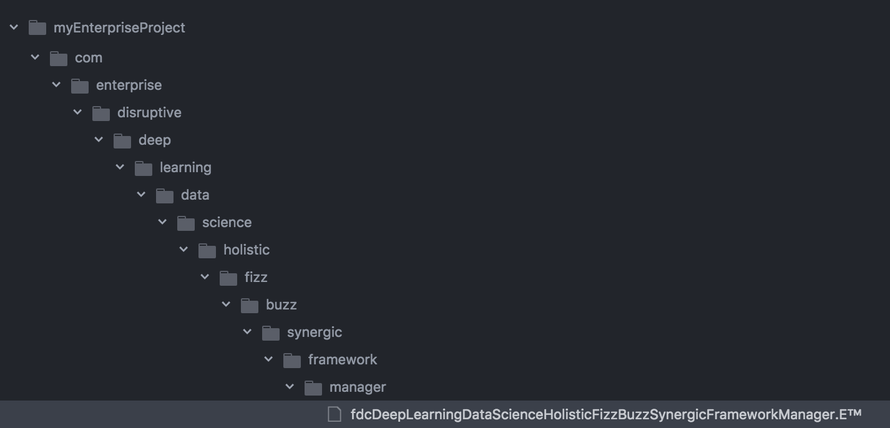

# Enterprise™


Enterprise™ is a non deterministic unnecessarily statically typed
Turing-complete programming language.

Enterprise™ is designed to create computer programs that disrupt markets.

### But why?

Following on the footsteps of [Rockstar](https://github.com/dylanbeattie/rockstar),
if we make Enterprise™ a real thing, then recruiters and hiring managers won't be
able to talk about 'enterprise developers' any more.

On top of that, articles about the "Best Programming Languages for Enterprise
Development" will lose their meaning.

## Enterprise™ guide

* [Comments](#chapter-1-comments)
* [Classes](#chapter-2-classes)
* [Extensions and file structure](#chapter-3-extensions-and-file-structure)
* [Variables and types](#chapter-4-variables-and-types)
* [Operations](#chapter-5-operations)
* [Built in methods](#chapter-6-built-in-methods)
* [Implementations](#implementations)

### Chapter 1: comments

The most important bit in the Enterprise™ are comments. There are 8 different
types of comments in Enterprise™. Some of them are found in languages not ready
for corporate usage like:

##### line comment

```java
// this is boring a line comment
```

The line comment is useful when you want to restate what the next line does.
Here's an idiomatic example:

```java
// adds one to counter
counter++
```

##### block comment

```java
/*
  this is a block comment
*/
```

The block comment is useful when a comment is long, like explaining some
implementation:

```java
/*
  The International Enterprise™ Association only certifies code with a block
  comment that exceeds three lines, so this comment guarantes our future
  certification.
*/
```

On top of these, Enterprise™ adds:

##### copyright comment

```
/©
  This code is property of ACME™ studios 2017.
©/
```

Every Enterprise™ program _must_ begin with a copyright notice, else it will
not compile and fail with an `UnexpectedNonDisruptiveOpenSourceException` error.

It's customary to cover any non trivial implementation in Enterprise™ with a
copyright (and a comment). On top of that add an NDA comment (see below).

##### NDA comment

```
/©
  This following code implements a "Web Dropdown Menu", copyright number 9283F3.
©/
/NDA
  The following code can only be read if you signed NDA 375-1. If you happen to
  read it by mistake, send a written letter to our legal department with two
  attached copies immediately.
NDA/
```

##### passive agressive comment

```
/?
  This next bit is oh so lovely
?/
```

Things like irony may be a problem in communication. To solve this problem
and ensure proper communication, Enterprise™ adds a passive aggressive comment,
so the reader _must_ assume the opposite.

##### interview comment

Since Enterprise™ will be widely used for job interviews, the interview comment
is very handy to "explain how you reason" to your interviewer:

```
/¯\_(ツ)_/¯
  ...this could be done in O(1) if I had the time...
¯\_(ツ)_/¯/
```

##### improve in the future comment

```
/soon 1985-11-20
  using a while here would be more performatic
soon/
```

If you can't write the best implementation Today, use a improve in the future
comment, to ensure it will be done some day. Adding the current day in the
comment is part of it's syntax, so one doesn't lose track of oldest comments.

##### deadline comment

Deadline comments are extremely important to have our code disrupting the market
on time, seizing all the opportunity costs. Deadline comments also have a date
attached.

```
/deadline 1997-01-11
  We need to ship this game before Xmas. No delays accepted.
deadline/
/deadline 1998-01-11
  We need to ship this game before Xmas, we already lost the previous one.
deadline/
/deadline 1999-01-11
  We need to ship this game before Xmas, this time for real.
deadline/
/deadline 2000-01-11
  The board is extremely impatient. No excuses this time.
deadline/
/deadline 2002-01-11
  Come on people, they just gave us a 2 years extention after that horrible
  meeting. Let's not let 'em down this time.
deadline/
/deadline 2005-01-11
  Ok... this game may not happen and we may through this 8 year old effort in
  the wastebin of History if we don't get this done. Blogs are making a joke of
  us. Think about your families.
deadline/
/deadline 2011-01-11
  I don't know what to say. This is the biggest delay in game History. We're a
  laughingstock.
deadline/
/soon 2011-01-11
  We delivered! But we probably need to refactor everything very soon if we're
  to have a next release.
soon/
```

### Chapter 2: classes

#### naming

Classes are named with Hungarian Case. Hungarian Case is similar to Pascal Case,
but is prefixed with one or more type characters (see more below). A class must
end with an Enterpresey™ suffix (these suffixes are copyrighted and any use in
other languages may be investigated by our lawyers).

Type characters applicable to classes:

* `fdc` final disruptive class
* `fuc` final unnecessary class

#### Enterpresey™ terms:

After the prefix, a class name may have any number of Enterpresey™ terms. In
Enterprese™, differently from other languages, class names are not open to
developers "cre-a-ti-vi-ty". That's because naming is known to be a hard
problem, and limiting the alternatives makes it so much more predictable. Also,
forcing developers to comply with that list will boost communication, since
they'll share a common lingo.

Here's the full list of accepted Enterpresey™ terms:

||||||||
|-|-|-|-|-|-|-|
|Accelerate|Acceleration|Account|Active|Activity|Agile|Agility|
|Ajax|Algo|Analytics|Analyze|Analyzer|Ballpark|Big|
|Bit|Bizmeth|Block|Boost|Bootstrap|Bootstraped|Brand|
|Business|Buzz|Car|Chain|Chart|Clickthrough|Cloud|
|Coin|Consumer|Content|Converge|Convergence|Coordinate|Coordinator|
|Complex|Convert|Convertion|Cost|Costs|Critical|Crypto|
|Currency|Customer|Cyber|Data|Deep|Delegate|Delegator|
|Design|Dev|Develop|Development|Digital|Disrupt|Disruptor|
|Disruptive|Diverse|Diversify|Diversifier|Diversity|Downsize|Downsized|
|Drive|Driven|Driver|Economy|Economic|Employ|Employee|
|Employer|Empowered|Engine|Enterprise|Entrepreneur|Entropy|Equity|
|Evolution|Evolve|Evolving|Eyeball|Eyeballs|Facade|Factory|
|Fast|Fee|Fizz|Flat|Founder|Founders|Framework|
|Free|Future|Fuzzy|Generate|Generation|Generator|Global|
|Gluten|Graph|Graphic|Group|Growth|Guideline|Guidelines|
|Hack|Hacking|Hardware|Holistic|Human|Hyperlocal|Immerse|
|Immersion|Immersive|Innovate|Innovative|Innovativity|Innovator|Internet|
|Intranet|Invest|Investment|Item|Iterator|Java|Lactose|
|Learn|Learning|Leverage|Line|List|Manage|Management|
|Manager|Market|Marketing|Media|Mega|Merchant|Message|
|Micro|Millenial|Mindshare|Mine|Mining|Mission|Module|
|Momentum|Money|Nano|Network|New|Next|Number|
|Nut|Object|Operation|Operator|Opportunity|Ops|Order|
|Organic|Paradigm|Passionate|Pattern|Person|Pie|Point|
|Policy|Portal|Product|Proof|Provable|Proxy|Resource|
|Return|Roadmap|Scalable|Science|Self|Service|Services|
|Share|Sharing|Simple|Skeuomorphic|Speed|Software|Solution|
|Square|Startup|Streamline|Streamlined|Super|Sustainability|Sustainable|
|Synergic|Synergy|System|Tax|Text|Time|Trade|
|Trans|Upsize|Upsizer|User|Viral|Virality|Viralize|
|Visual|Web|World|

On top of these terms, you can use any upcase char (A-Z) and number, like in
"fdcVisualCRMWebDelegator" or "fdcViralB2BMicroServiceManager".

Finally, some articles are admitted:

```java
["As", "To", "Of", "In", "Out", "On", "Off", "At", "Not", "Non", "With", "Without"]
```

This can be used to compose, as in `fdcNextGenerationRoadmapAsAServiceProxy` or
`fdcProxyOfUserWithSustainableOrganicGlutenFreeFactory` or
`fdcTimeToMarketMomentumInnovator`.

##### disruptive class

An Enterprise™ program _must_ start with the disruptive class. Since it's not
instantiable or extendable, every `disruptive` class is also a `final` class:

```java
final disruptive class fdcMillenialUserManager {

}
```

A disruptive class doesn't have a constructor. It has only a `main` method
isntead. Since the method can't be changed by implementors, it must be `final`
and `immutable`. And since it returns nothing, it must be `void`.

```java
final disruptive class fdcMillenialUserManager {
  final immutable void main () {
    // here goes your code
  }
}
```

### unnecessary classes

Since all code in Enterprise™ goes in the disruptive class, any other class you
declare, although syntatically correct, is unnecessary. Because of that, they
_must_ start with the `unnecessary` keyword. Since they can't be extended or
instantiated, they're also final. Although disruptive classes have a very
specific location in your folder structure, unnecessary classes can go anywhere
(see more on next chapter). Here's an example of an unnecessary class:

```java
final unnecessary class fucNutFreeUserManager {}
```

These classes can have a constructor, so that if they _were_ used, they _could_
receive params. Since constructors don't return, they must be `void`. Since
the methods can't be overriden – or used –, they're also `final` and `unnecessary`:

```java
final unnecessary class fucNutFreeUserManager {
  final unnecessary void constructor(String name, Int nutsEatn, Int maxNuts) {
    this.name = name
    this.nutsEatn = nutsEatn
    this.maxNuts = maxNuts
  }

  final unnecessary Int nutsTillDeath() {
    return this.maxNuts - this.nutsEatn
  }
}
```

### Chapter 3: Extensions and file structure

All Enterprise™ use the extension "E™". This is to make clear these files are
under a trade mark in a quick glance.

Your folder structure dependends on the name of your disruptive class. Let's say
your disruptive class is called
`fdcDeepLearningDataScienceHolisticFizzBuzzSynergicFrameworkManager`, each word
represents a nested folder you have to create, in addition to the standard
`/com/enterprise/disruptive`. So your folder structure will look like:

```
/com
  /enterprise
    /disruptive
      /deep
        /learning
          /data
            /science
              /holistic
                /fizz
                  /buzz
                    /synergic
                      /framework
                        /manager
                          fdcDeepLearningDataScienceHolisticFizzBuzzSynergicFrameworkManager.E™
```

Here's that structure in a random editor:



As stated in previous chapter, unnecessary classes don't need to follow this
structure. As a matter of fact, the more random you place them, the better.

### Chapter 4: variables and types

Complicated types only makes software complicated. So Enterprise™ has a minimal
list of types:

```java
Int
Float
String
Bool
List
O1Type
XML
Null
```

##### Syntax

Here's how you declare a variable in Enterprise™:

```java
var Type name = value;;;
```

`Type` is one of the types above.

`name` is any char sequence you want, as long as it doesn't exceed 1 char for
integers and floats and 8 chars for other types.

`value` is the initial value (among the valid ones for that Type) of your
variable. If a variable is not used, you may add the `unnecessary` flag to it.

The instructions must be ended with three semicolons. This adds clarity to where
it ends, beats OCaml in 1 and makeys your `;` key weathered over time, so it
will look like you work a lot.

Examples:

```java
var Int i = 32;;;
unnecessary var String name = 'Charles';;;
unnecessary var Float p = 3.14;;;
unnecessary var Bool isNew = True;;;
unnecessary var Bool isNew = False;;;
unnecessary var Null salary = Null;;;
unnecessary var List Int numbas = [10, 20];;;
unnecessary var List String buzzws = ['viral', 'cloud', 'blockchain'];;;
unnecessary var O1Type String mlnlUser = {name: 'XX JLo'};;;
unnecessary var O1Type Int example = {foo: 1, bar: 2};;;
unnecessary var XML String example = // TBD
```

##### Int

// TBD

##### String

// TBD

##### List

// TBD

##### O1Type

The O1Type, commonly known as "hash table" in other languages, is named this way
to simplify interviews. If you're asked:

> "Which type could we use here to have a O(1) lookup?"

You can simply say, with all your confidence:

> "The ... O1 ... Type ...?"

Nailed.

##### XML

// TBD


### Chapter 5: operations

##### Numeric operations

```java
2 + 3;;; // 5
2 - 3;;; // -1
2 * 3;;; // 6
2 / 3;;; // 0.66666666 (see note below)
3 % 2;;; // 1 (mod)

var myInt i = 2;;;
i += 1;;; // 3
i -= 1;;; // 1
i *= 1;;; // 2
i /= 1;;; // 2 (see note below)

2 > 3;;; // False
2 < 3;;; // True
2 == 3;;; // False
2 != 3;;; // True
```

Since floats take too much time to implement properly, and it's more important
to get Enterprise™ implementations out there, this guid will not dictate how
float operations should behave. Therefore, as an example, all of these are fine:

```java
2 / 3;;; // 0.66666666
2 / 3;;; // 0.67
2 / 3;;; // 0.7
2 / 3;;; // 1
2 / 3;;; // 0
```

Anything goes really, as long as you properly document the behaviour of your
implementation.

##### String operations

Templates are too complicated, therefore Enterprise™ has only concat:

```java
'abc' + 'def';;; // 'abcdef'

var String myString = 'foo';;;
myString += 'bar';;; // 'foobar'
```

##### Bool operations

```java
!True // False
!False // True
True && True // True
True && False // False
False && False // False
```

That's it. If you did logic in your CS degree you must be able to do `or`s,
`xors` and everything else based on these two.

##### List access

You can easily access list items:

```java
var List Int ns = [7, 8, 9];;;
ns[1];;; // 8
```

##### O1Type access

You can easily access list items:

```java
var O1Type Int grades = {john: 6, mary: 5};;;
grades['john'];;; // 6
grades['mary'];;; // 5
```

### Chapter 6: built in methods

##### String

```java
'hello'.length();;; // 5
'hello'.split();;; // ['h', 'e', 'l', 'l', 'o']
```

With these 2 basic methods you can do anthing. Substring? No problem:

```java
// inside main of course
var String hello = '';;;
var String helloWor = 'Hello World';;;
var Int i = 0;;;
unnecessary var Int j = 0;;;

var List String hWList = helloWor.split();;;
while(i < 5) {
  hello += hWList[i];;;
  i++;;;
}
```

##### List

```java
['a'].length() // 1
['a'].push('b') // ['a', 'b']
```

This should be enough. Concat? Easy:

```java
// inside main of course
var List String chars1 = ['a', 'b'];;;
var List String chars2 = ['c', 'd'];;;
var Int i = 0;;;

while(i < chars2.length()) {
  chars1.push(chars2[i]);;;
  i++;;;
}
```

##### O1Type

```java
{name: 'John'}.keys() // ['name']
{name: 'John'}.values() // ['John']
```

### Chapter 7: control structures

To avoid those pesky functional programmers to take over, Enterprise™ has no
iterators. No higher order whatever. No LGADBTS. You can do everything with
`if`s and `while`s. As a wise Enterprise™ developer once said:

> "You can do anything with any language."

##### while

```
while(condition) {
  // code
}
```

##### if

```
if(condition) {
  // code
}
```

### Implementations

// TBD

### Roadmap

1. Automatic unnecessary classes generator.
